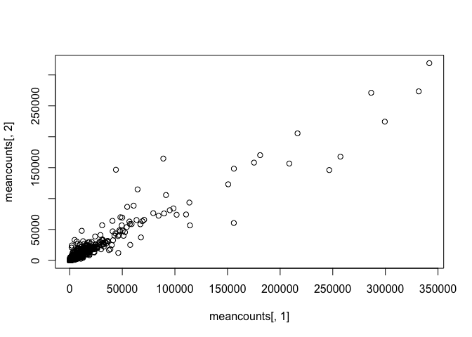
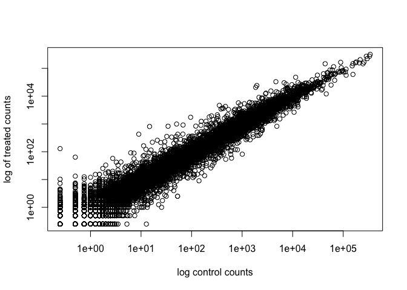
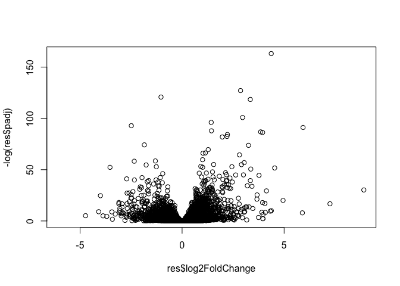
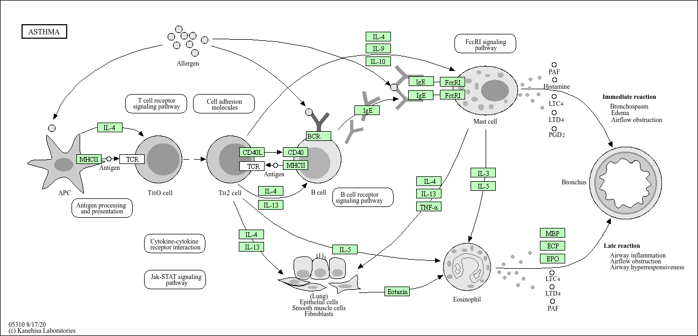
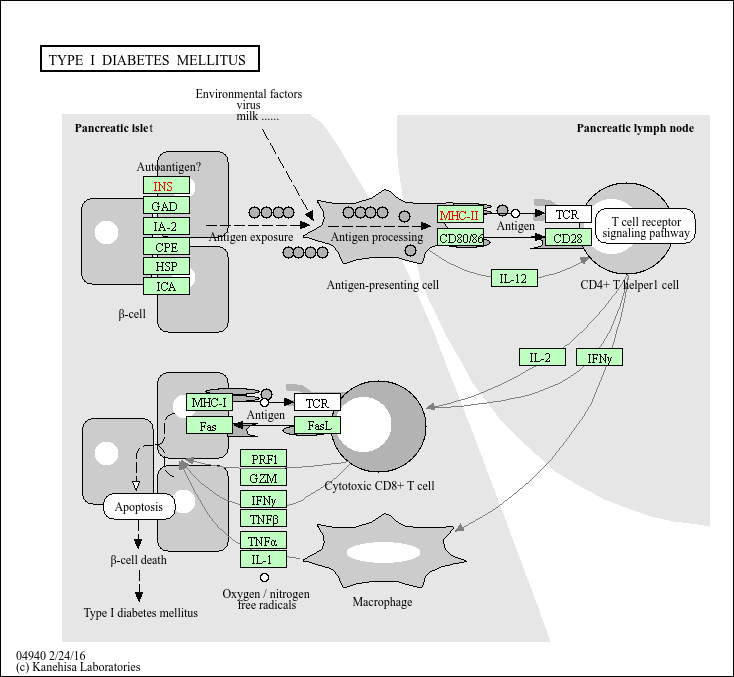

# class13_Volcano


This week we are looking at differential expression analysis.

The data for this hands-on session comes from a published RNA-seq
experiment where airway smooth muscle cells were treated with
dexamethasone, a synthetic glucocorticoid steroid with anti-inflammatory
effects (Himes et al. 2014).

## Import / Read the data from Himes et al.

``` r
counts <- read.csv("airway_scaledcounts.csv", row.names=1)
metadata <- read.csv("airway_metadata.csv")
```

Let’s have a week peak at this data

``` r
head(metadata)
```

              id     dex celltype     geo_id
    1 SRR1039508 control   N61311 GSM1275862
    2 SRR1039509 treated   N61311 GSM1275863
    3 SRR1039512 control  N052611 GSM1275866
    4 SRR1039513 treated  N052611 GSM1275867
    5 SRR1039516 control  N080611 GSM1275870
    6 SRR1039517 treated  N080611 GSM1275871

Sanity check on correspondence of counts and metadata.

``` r
all(metadata$id == colnames(counts))
```

    [1] TRUE

> Q1. How many genes are in this dataset?

There are 38694 genes in this dataset.

``` r
nrow(counts)
```

    [1] 38694

There are 38964 genes \>Q2. How many ‘control’ cell lines do we have?

``` r
n.control <- sum(metadata$dex == "control")
```

There are 4 control cell lines in this dataset

### Extract and summarize the control samples

To find out where the control samples are, we need the metadata

``` r
control <- metadata[metadata$dex == "control",]
control.counts <- counts[,control$id]
control.mean <- rowMeans(control.counts)
head(control.mean)
```

    ENSG00000000003 ENSG00000000005 ENSG00000000419 ENSG00000000457 ENSG00000000460 
             900.75            0.00          520.50          339.75           97.25 
    ENSG00000000938 
               0.75 

> Q3. How would you make the above code in either approach more robust?
> Is there a function that could help here?

An approach which verifies that the colnames(counts) are matching up
with the
metadata$id. Therefore, we must always include this: metadata$dex ==
“control”

## Extract and summarize the treated (i.e. drug) samples

> Q4. Follow the same procedure for the treated samples (i.e. calculate
> the mean per gene across drug treated samples and assign to a labeled
> vector called treated.mean)

``` r
treated <- metadata[metadata$dex == "treated",]
treated.counts <- counts[,treated$id]
treated.mean <- rowMeans(treated.counts)
head(treated.mean)
```

    ENSG00000000003 ENSG00000000005 ENSG00000000419 ENSG00000000457 ENSG00000000460 
             658.00            0.00          546.00          316.50           78.75 
    ENSG00000000938 
               0.00 

Store these results together in a new data frame called `meancounts`
Lets make a plot to explore the results a little

``` r
meancounts <- data.frame(control.mean, treated.mean)
```

Let’s makr a plot to explore these results a little

``` r
plot(meancounts[,1], meancounts[,2])
```



``` r
library(ggplot2)

ggplot(meancounts) +
  aes(control.mean, treated.mean) + 
  geom_point()
```


We will make a log-log plot to draw out this skewed data and see what is
going on.

Q6. Try plotting both axes on a log scale. What is the argument to
plot() that allows you to do this? log=‘xy’

``` r
plot(meancounts[,1], meancounts[,2], log='xy',
     xlab="log control counts",
     ylab="log of treated counts")
```

    Warning in xy.coords(x, y, xlabel, ylabel, log): 15032 x values <= 0 omitted
    from logarithmic plot

    Warning in xy.coords(x, y, xlabel, ylabel, log): 15281 y values <= 0 omitted
    from logarithmic plot



We often use log2 transformations when dealing with this sort of data.

``` r
log2(20/20)
```

    [1] 0

``` r
log2(40/20)
```

    [1] 1

``` r
log2(80/20)
```

    [1] 2

This log2 transformation has this nice property where if there is no
change the log2 value will be zero and if it double the log2 value will
be 1 and if halved it will be -1.

So let’s add a log2 fold change column to our results so far

``` r
meancounts$log2fc <- (meancounts$treated.mean / 
                        meancounts$control.mean)
```

``` r
head(meancounts)
```

                    control.mean treated.mean    log2fc
    ENSG00000000003       900.75       658.00 0.7305024
    ENSG00000000005         0.00         0.00       NaN
    ENSG00000000419       520.50       546.00 1.0489914
    ENSG00000000457       339.75       316.50 0.9315673
    ENSG00000000460        97.25        78.75 0.8097686
    ENSG00000000938         0.75         0.00 0.0000000

We need to get rid of zero count genes that we can not say anything
about.

``` r
zero.vales <- which(meancounts[,1:2]==0, arr.ind=TRUE)
to.rm <- unique(zero.vales[,1])
mycounts <- meancounts[-to.rm, ]
```

``` r
head(mycounts)
```

                    control.mean treated.mean    log2fc
    ENSG00000000003       900.75       658.00 0.7305024
    ENSG00000000419       520.50       546.00 1.0489914
    ENSG00000000457       339.75       316.50 0.9315673
    ENSG00000000460        97.25        78.75 0.8097686
    ENSG00000000971      5219.00      6687.50 1.2813757
    ENSG00000001036      2327.00      1785.75 0.7674044

Q7. What is the purpose of the arr.ind argument in the which() function
call above? Why would we then take the first column of the output and
need to call the unique() function? It tells you which rows and columns
have the zeros Unique is needed so that the rows with zeros only apprea
once even if they have multiple zeros.

How many genes are remaining?

``` r
nrow(mycounts)
```

    [1] 21817

# Use fold change to see up and down regulated genes.

A common threshold used for calling something differentially expressed
is a log2(FoldChange) of greater than 2 or less than -2. Let’s filter
the dataset both ways to see how many genes are up or down-regulated.

``` r
sum(mycounts$log2fc > 2)
```

    [1] 1027

and down regulated

``` r
sum(mycounts$log2fc < 2)
```

    [1] 20459

> Q10. Do you trust these results? Why or why not?

Not fully because we don’t yet know if these changes are significant…

# DESeq2 analysis

Let’s do this the right way. DESeq2 is an R package specifically for
analyzing count-based NGS data like RNA-seq. It is available from
Bioconductor. Bioconductor is a project to provide tools for analyzing
high-throughput genomic data including RNA-seq, ChIP-seq and arrays.

``` r
library(DESeq2)
```

    Loading required package: S4Vectors

    Loading required package: stats4

    Loading required package: BiocGenerics

    Loading required package: generics


    Attaching package: 'generics'

    The following objects are masked from 'package:base':

        as.difftime, as.factor, as.ordered, intersect, is.element, setdiff,
        setequal, union


    Attaching package: 'BiocGenerics'

    The following objects are masked from 'package:stats':

        IQR, mad, sd, var, xtabs

    The following objects are masked from 'package:base':

        anyDuplicated, aperm, append, as.data.frame, basename, cbind,
        colnames, dirname, do.call, duplicated, eval, evalq, Filter, Find,
        get, grep, grepl, is.unsorted, lapply, Map, mapply, match, mget,
        order, paste, pmax, pmax.int, pmin, pmin.int, Position, rank,
        rbind, Reduce, rownames, sapply, saveRDS, table, tapply, unique,
        unsplit, which.max, which.min


    Attaching package: 'S4Vectors'

    The following object is masked from 'package:utils':

        findMatches

    The following objects are masked from 'package:base':

        expand.grid, I, unname

    Loading required package: IRanges

    Loading required package: GenomicRanges

    Loading required package: Seqinfo

    Loading required package: SummarizedExperiment

    Loading required package: MatrixGenerics

    Loading required package: matrixStats


    Attaching package: 'MatrixGenerics'

    The following objects are masked from 'package:matrixStats':

        colAlls, colAnyNAs, colAnys, colAvgsPerRowSet, colCollapse,
        colCounts, colCummaxs, colCummins, colCumprods, colCumsums,
        colDiffs, colIQRDiffs, colIQRs, colLogSumExps, colMadDiffs,
        colMads, colMaxs, colMeans2, colMedians, colMins, colOrderStats,
        colProds, colQuantiles, colRanges, colRanks, colSdDiffs, colSds,
        colSums2, colTabulates, colVarDiffs, colVars, colWeightedMads,
        colWeightedMeans, colWeightedMedians, colWeightedSds,
        colWeightedVars, rowAlls, rowAnyNAs, rowAnys, rowAvgsPerColSet,
        rowCollapse, rowCounts, rowCummaxs, rowCummins, rowCumprods,
        rowCumsums, rowDiffs, rowIQRDiffs, rowIQRs, rowLogSumExps,
        rowMadDiffs, rowMads, rowMaxs, rowMeans2, rowMedians, rowMins,
        rowOrderStats, rowProds, rowQuantiles, rowRanges, rowRanks,
        rowSdDiffs, rowSds, rowSums2, rowTabulates, rowVarDiffs, rowVars,
        rowWeightedMads, rowWeightedMeans, rowWeightedMedians,
        rowWeightedSds, rowWeightedVars

    Loading required package: Biobase

    Welcome to Bioconductor

        Vignettes contain introductory material; view with
        'browseVignettes()'. To cite Bioconductor, see
        'citation("Biobase")', and for packages 'citation("pkgname")'.


    Attaching package: 'Biobase'

    The following object is masked from 'package:MatrixGenerics':

        rowMedians

    The following objects are masked from 'package:matrixStats':

        anyMissing, rowMedians

``` r
dds <- DESeqDataSetFromMatrix(countData=counts, 
                              colData=metadata, 
                              design=~dex)
```

    converting counts to integer mode

    Warning in DESeqDataSet(se, design = design, ignoreRank): some variables in
    design formula are characters, converting to factors

``` r
dds <- DESeq(dds)
```

    estimating size factors

    estimating dispersions

    gene-wise dispersion estimates

    mean-dispersion relationship

    final dispersion estimates

    fitting model and testing

``` r
res <- results(dds)
res
```

    log2 fold change (MLE): dex treated vs control 
    Wald test p-value: dex treated vs control 
    DataFrame with 38694 rows and 6 columns
                     baseMean log2FoldChange     lfcSE      stat    pvalue
                    <numeric>      <numeric> <numeric> <numeric> <numeric>
    ENSG00000000003  747.1942      -0.350703  0.168242 -2.084514 0.0371134
    ENSG00000000005    0.0000             NA        NA        NA        NA
    ENSG00000000419  520.1342       0.206107  0.101042  2.039828 0.0413675
    ENSG00000000457  322.6648       0.024527  0.145134  0.168996 0.8658000
    ENSG00000000460   87.6826      -0.147143  0.256995 -0.572550 0.5669497
    ...                   ...            ...       ...       ...       ...
    ENSG00000283115  0.000000             NA        NA        NA        NA
    ENSG00000283116  0.000000             NA        NA        NA        NA
    ENSG00000283119  0.000000             NA        NA        NA        NA
    ENSG00000283120  0.974916       -0.66825   1.69441 -0.394385  0.693297
    ENSG00000283123  0.000000             NA        NA        NA        NA
                         padj
                    <numeric>
    ENSG00000000003  0.163017
    ENSG00000000005        NA
    ENSG00000000419  0.175937
    ENSG00000000457  0.961682
    ENSG00000000460  0.815805
    ...                   ...
    ENSG00000283115        NA
    ENSG00000283116        NA
    ENSG00000283119        NA
    ENSG00000283120        NA
    ENSG00000283123        NA

We can get some basic summary tallies using the `summary()` function

``` r
summary(res, alpha=0.05)
```


    out of 25258 with nonzero total read count
    adjusted p-value < 0.05
    LFC > 0 (up)       : 1242, 4.9%
    LFC < 0 (down)     : 939, 3.7%
    outliers [1]       : 142, 0.56%
    low counts [2]     : 9971, 39%
    (mean count < 10)
    [1] see 'cooksCutoff' argument of ?results
    [2] see 'independentFiltering' argument of ?results

# Volcano plot

Make a summary plot of our results.

``` r
plot(res$log2FoldChange, -log(res$padj))
```



Finish for today by saving our results

``` r
write.csv(res, file="DESeq2_results.csv")
```

# Add annotation to data

Let’s start by mapping our ENSEMBLE ids to the more conventional gene
SYMBOL.

We will use two bioconductor packages for this “mapping”
**AnnotationDbi** and **org.Hs.eg.db**.

We will firstneed to install these from bioconductor with
`BiocManager::install("AnnotationDbi")`

``` r
library(AnnotationDbi)
library(org.Hs.eg.db)
```

``` r
columns(org.Hs.eg.db)
```

     [1] "ACCNUM"       "ALIAS"        "ENSEMBL"      "ENSEMBLPROT"  "ENSEMBLTRANS"
     [6] "ENTREZID"     "ENZYME"       "EVIDENCE"     "EVIDENCEALL"  "GENENAME"    
    [11] "GENETYPE"     "GO"           "GOALL"        "IPI"          "MAP"         
    [16] "OMIM"         "ONTOLOGY"     "ONTOLOGYALL"  "PATH"         "PFAM"        
    [21] "PMID"         "PROSITE"      "REFSEQ"       "SYMBOL"       "UCSCKG"      
    [26] "UNIPROT"     

``` r
res$symbol <- mapIds(org.Hs.eg.db,
                      keys = rownames(res), #Our ids
                      keytype = "ENSEMBL", #Their format
                      column = "SYMBOL") #What I want to translate to
```

    'select()' returned 1:many mapping between keys and columns

res\$symbol creates new column named symbol

``` r
head(res)
```

    log2 fold change (MLE): dex treated vs control 
    Wald test p-value: dex treated vs control 
    DataFrame with 6 rows and 7 columns
                      baseMean log2FoldChange     lfcSE      stat    pvalue
                     <numeric>      <numeric> <numeric> <numeric> <numeric>
    ENSG00000000003 747.194195      -0.350703  0.168242 -2.084514 0.0371134
    ENSG00000000005   0.000000             NA        NA        NA        NA
    ENSG00000000419 520.134160       0.206107  0.101042  2.039828 0.0413675
    ENSG00000000457 322.664844       0.024527  0.145134  0.168996 0.8658000
    ENSG00000000460  87.682625      -0.147143  0.256995 -0.572550 0.5669497
    ENSG00000000938   0.319167      -1.732289  3.493601 -0.495846 0.6200029
                         padj      symbol
                    <numeric> <character>
    ENSG00000000003  0.163017      TSPAN6
    ENSG00000000005        NA        TNMD
    ENSG00000000419  0.175937        DPM1
    ENSG00000000457  0.961682       SCYL3
    ENSG00000000460  0.815805       FIRRM
    ENSG00000000938        NA         FGR

> Q. Can you add “GENENAME” and “ENTREZID” as new column to `res` as
> “name” and “entrez”?

``` r
res$name <- mapIds(org.Hs.eg.db,
                      keys = rownames(res), 
                      keytype = "ENSEMBL", 
                      column = "GENENAME") 
```

    'select()' returned 1:many mapping between keys and columns

``` r
res$entrez <- mapIds(org.Hs.eg.db,
                      keys = rownames(res),
                      keytype = "ENSEMBL", 
                      column = "ENTREZID") 
```

    'select()' returned 1:many mapping between keys and columns

``` r
head(res)
```

    log2 fold change (MLE): dex treated vs control 
    Wald test p-value: dex treated vs control 
    DataFrame with 6 rows and 9 columns
                      baseMean log2FoldChange     lfcSE      stat    pvalue
                     <numeric>      <numeric> <numeric> <numeric> <numeric>
    ENSG00000000003 747.194195      -0.350703  0.168242 -2.084514 0.0371134
    ENSG00000000005   0.000000             NA        NA        NA        NA
    ENSG00000000419 520.134160       0.206107  0.101042  2.039828 0.0413675
    ENSG00000000457 322.664844       0.024527  0.145134  0.168996 0.8658000
    ENSG00000000460  87.682625      -0.147143  0.256995 -0.572550 0.5669497
    ENSG00000000938   0.319167      -1.732289  3.493601 -0.495846 0.6200029
                         padj      symbol                   name      entrez
                    <numeric> <character>            <character> <character>
    ENSG00000000003  0.163017      TSPAN6          tetraspanin 6        7105
    ENSG00000000005        NA        TNMD            tenomodulin       64102
    ENSG00000000419  0.175937        DPM1 dolichyl-phosphate m..        8813
    ENSG00000000457  0.961682       SCYL3 SCY1 like pseudokina..       57147
    ENSG00000000460  0.815805       FIRRM FIGNL1 interacting r..       55732
    ENSG00000000938        NA         FGR FGR proto-oncogene, ..        2268

``` r
write.csv(res, file = "results_annotated.csv")
```

## Pathway analysis

Now we know the gene names (gene symbols) and their entrez IDs we can
find out what pathways they are involved in. This is called “pathway
analysis” or “gene set enrichment”.

We will use the **gage** package and the **pathviewer** package to do
this analysis (but there are loads of others).

``` r
library(gage)
library(gageData)
library(pathview)
```

Lets’ see what is in the gageData, specifically KEGG pathways:

``` r
data(kegg.sets.hs)
head(kegg.sets.hs, 2)
```

    $`hsa00232 Caffeine metabolism`
    [1] "10"   "1544" "1548" "1549" "1553" "7498" "9"   

    $`hsa00983 Drug metabolism - other enzymes`
     [1] "10"     "1066"   "10720"  "10941"  "151531" "1548"   "1549"   "1551"  
     [9] "1553"   "1576"   "1577"   "1806"   "1807"   "1890"   "221223" "2990"  
    [17] "3251"   "3614"   "3615"   "3704"   "51733"  "54490"  "54575"  "54576" 
    [25] "54577"  "54578"  "54579"  "54600"  "54657"  "54658"  "54659"  "54963" 
    [33] "574537" "64816"  "7083"   "7084"   "7172"   "7363"   "7364"   "7365"  
    [41] "7366"   "7367"   "7371"   "7372"   "7378"   "7498"   "79799"  "83549" 
    [49] "8824"   "8833"   "9"      "978"   

To run our pathway analysis we will use the **gage()** function. It
wants two main inputs: a vector of importance (in our case the log2 fold
change values); and the gene sets to check overlap for.

``` r
foldchanges <- res$log2FoldChange
names(foldchanges) <- res$symbol
head(foldchanges)
```

         TSPAN6        TNMD        DPM1       SCYL3       FIRRM         FGR 
    -0.35070296          NA  0.20610728  0.02452701 -0.14714263 -1.73228897 

KEGG speaks entrez (i.e. muses ENTREZID format) not gene symbol format

``` r
names(foldchanges) <- res$entrez
```

``` r
keggres = gage(foldchanges, gsets=kegg.sets.hs)
```

``` r
head(keggres$less, 5)
```

                                                             p.geomean stat.mean
    hsa05332 Graft-versus-host disease                    0.0004250607 -3.473335
    hsa04940 Type I diabetes mellitus                     0.0017820379 -3.002350
    hsa05310 Asthma                                       0.0020046180 -3.009045
    hsa04672 Intestinal immune network for IgA production 0.0060434609 -2.560546
    hsa05330 Allograft rejection                          0.0073679547 -2.501416
                                                                 p.val      q.val
    hsa05332 Graft-versus-host disease                    0.0004250607 0.09053792
    hsa04940 Type I diabetes mellitus                     0.0017820379 0.14232788
    hsa05310 Asthma                                       0.0020046180 0.14232788
    hsa04672 Intestinal immune network for IgA production 0.0060434609 0.31387487
    hsa05330 Allograft rejection                          0.0073679547 0.31387487
                                                          set.size         exp1
    hsa05332 Graft-versus-host disease                          40 0.0004250607
    hsa04940 Type I diabetes mellitus                           42 0.0017820379
    hsa05310 Asthma                                             29 0.0020046180
    hsa04672 Intestinal immune network for IgA production       47 0.0060434609
    hsa05330 Allograft rejection                                36 0.0073679547

Let’s make a figure of one of these pathways with our DEGs highlighted:

``` r
pathview(foldchanges, pathway.id = "hsa05310")
```

    'select()' returned 1:1 mapping between keys and columns

    Info: Working in directory /Users/eloisesimpson/Documents/BIMM143/git_play/Bimm143_github/Class13_missedclass

    Info: Writing image file hsa05310.pathview.png



> Q. Generate and insert a pathway figure for “Graft-versus-host
> disease” and “Type I diabetes”?

``` r
pathview(foldchanges, pathway.id = "hsa04940")
```

    'select()' returned 1:1 mapping between keys and columns

    Info: Working in directory /Users/eloisesimpson/Documents/BIMM143/git_play/Bimm143_github/Class13_missedclass

    Info: Writing image file hsa04940.pathview.png



``` r
pathview(foldchanges, pathway.id = "hsa05332")
```

    'select()' returned 1:1 mapping between keys and columns

    Info: Working in directory /Users/eloisesimpson/Documents/BIMM143/git_play/Bimm143_github/Class13_missedclass

    Info: Writing image file hsa05332.pathview.png


