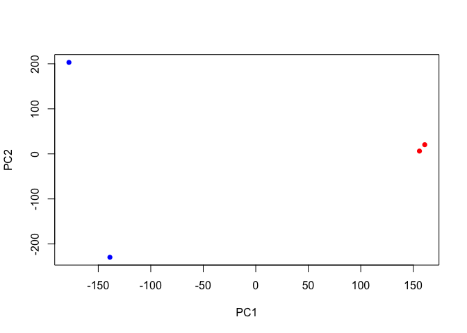
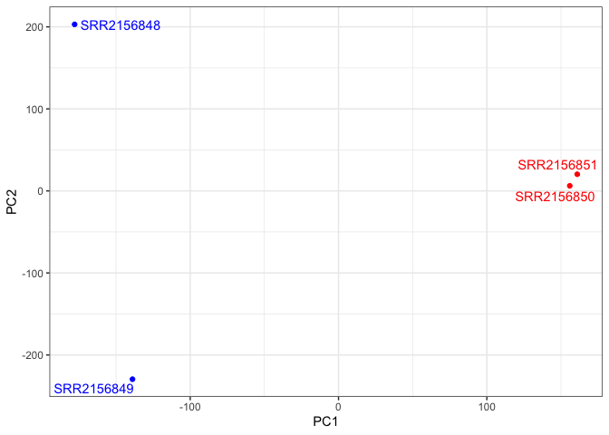

# class17_PCA


## Core Unix commands

Most unix commands have super short names, which makes them quick to
type but annoying to learn. Major file system related commands include.

pwd: Print working directory ls: List files and directories cd: Change
Directories mkdir: Make directories rm: remove files and directories
(delete) cp: copy files (source \> destination) mv: Move files
(basically re-name) nano: A wee text editor (very basic but always
available)

curl: Download files wget: Download files from the web tar -zxvf:UnTar
(unpackage) Tar archive files gunzip : UnZip files \$PATH: The places
(dirs) to look for programs

## AWS EC2 Instance

Connect to my instance with: ssh -i ~/Downloads/bimm143_eloise.pem
ubuntu@ec2-54-202-63-98.us-west-2.compute.amazonaws.com

Github link: https://github.com/EloiseSimpson/Bimm143_githhub/tree/main

Secure copy files between machines, in this case from our instance to
our laptop scp -i ~/Downloads/bimm143_eloise.pem
ubuntu@ec2-54-202-63-98.us-west-2.compute.amazonaws.com:/home/ubuntu/work/Bimm143_githhub/Class16/results.txt
.

## Class 17 instance

ssh -i “bimm143_eloise.pem”
ubuntu@ec2-52-33-145-234.us-west-2.compute.amazonaws.com

export KEY=~/Downloads/bimm143_eloise.pem export
SERVER=ubuntu@ec2-52-33-145-234.us-west-2.compute.amazonaws.com

ssh -i \$KEY \$SERVER scp -r

## Downstream Analysis

``` r
library(tximport)

base_path <- "class17"
folders <- dir(path = base_path, pattern = "SRR21568*", full.names = TRUE)
samples <- sub("_quant$", "", basename(folders))
files <- file.path(folders, "abundance.h5")
names(files) <- samples

txi.kallisto <- tximport(files, type = "kallisto", txOut = TRUE)
```

    1 2 3 4 

``` r
head(txi.kallisto$counts)
```

                    SRR2156848 SRR2156849 SRR2156850 SRR2156851
    ENST00000539570          0          0    0.00000          0
    ENST00000576455          0          0    2.62037          0
    ENST00000510508          0          0    0.00000          0
    ENST00000474471          0          1    1.00000          0
    ENST00000381700          0          0    0.00000          0
    ENST00000445946          0          0    0.00000          0

``` r
colSums(txi.kallisto$counts)
```

    SRR2156848 SRR2156849 SRR2156850 SRR2156851 
       2563611    2600800    2372309    2111474 

``` r
sum(rowSums(txi.kallisto$counts)>0)
```

    [1] 94561

``` r
to.keep <- rowSums(txi.kallisto$counts) > 0
kset.nonzero <- txi.kallisto$counts[to.keep,]
```

``` r
keep2 <- apply(kset.nonzero,1,sd)>0
x <- kset.nonzero[keep2,]
```

## Principal Component Analysis

``` r
pca <- prcomp(t(x), scale=TRUE)
summary(pca)
```

    Importance of components:
                                PC1      PC2      PC3   PC4
    Standard deviation     183.6379 177.3605 171.3020 1e+00
    Proportion of Variance   0.3568   0.3328   0.3104 1e-05
    Cumulative Proportion    0.3568   0.6895   1.0000 1e+00

``` r
plot(pca$x[,1], pca$x[,2],
     col=c("blue","blue","red","red"),
     xlab="PC1", ylab="PC2", pch=16)
```



``` r
library(ggplot2)
library(ggrepel)

mycols <- c("blue","blue","red","red")

ggplot(pca$x) +
  aes(PC1, PC2, label=rownames(pca$x)) +
  geom_point( col=mycols ) +
  geom_text_repel( col=mycols ) +
  theme_bw()
```


